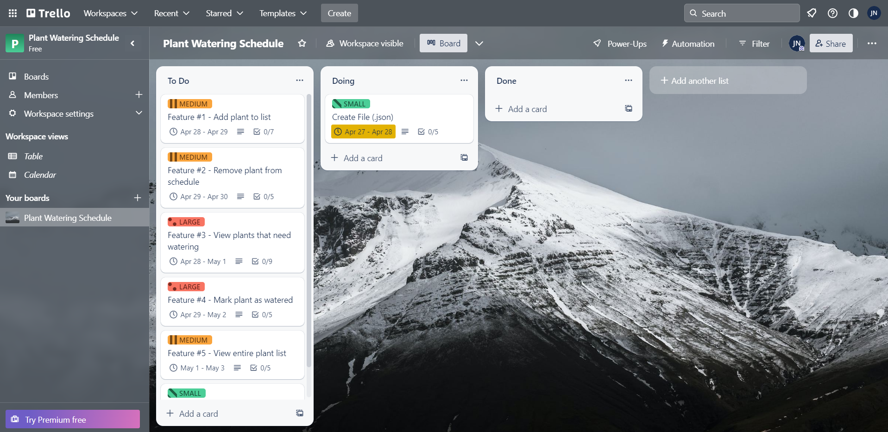
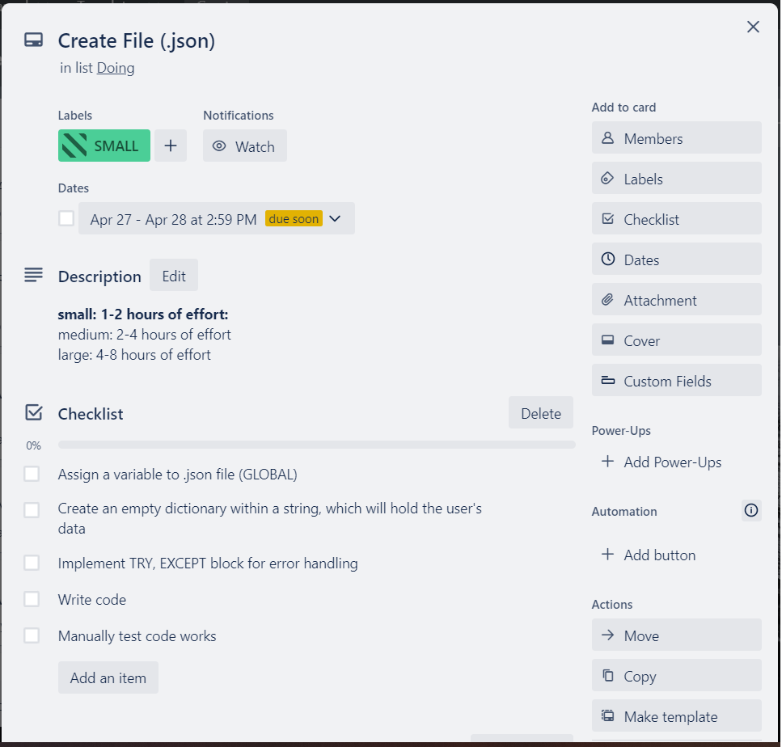
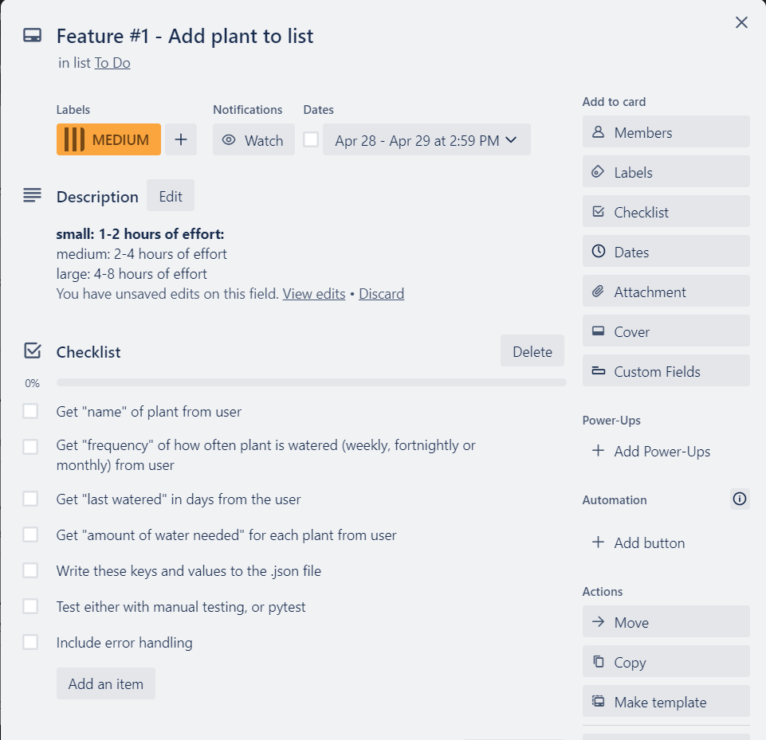
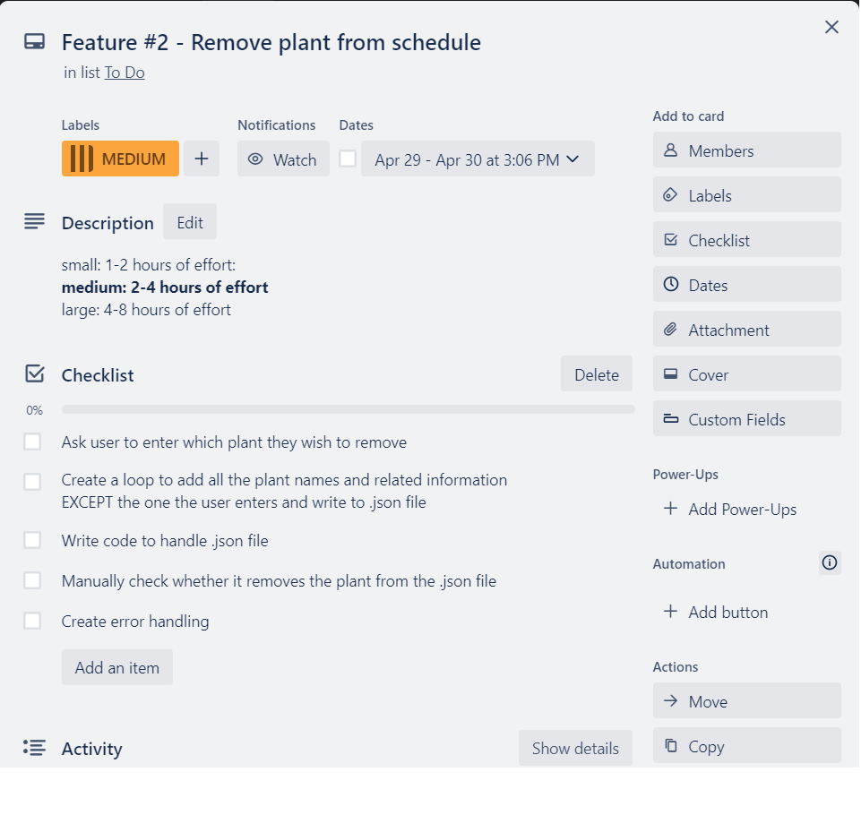
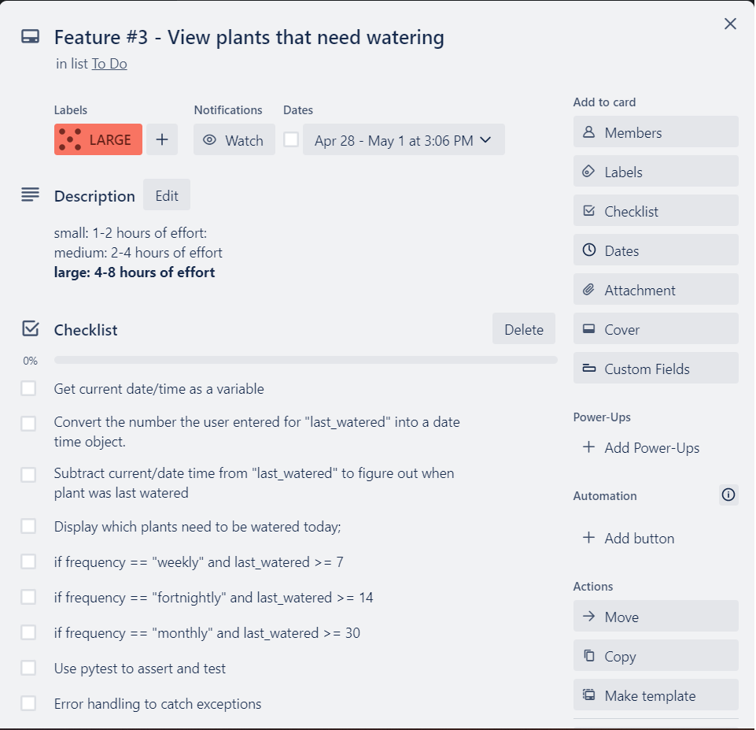
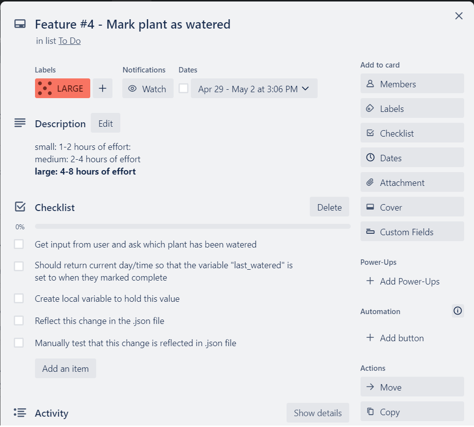
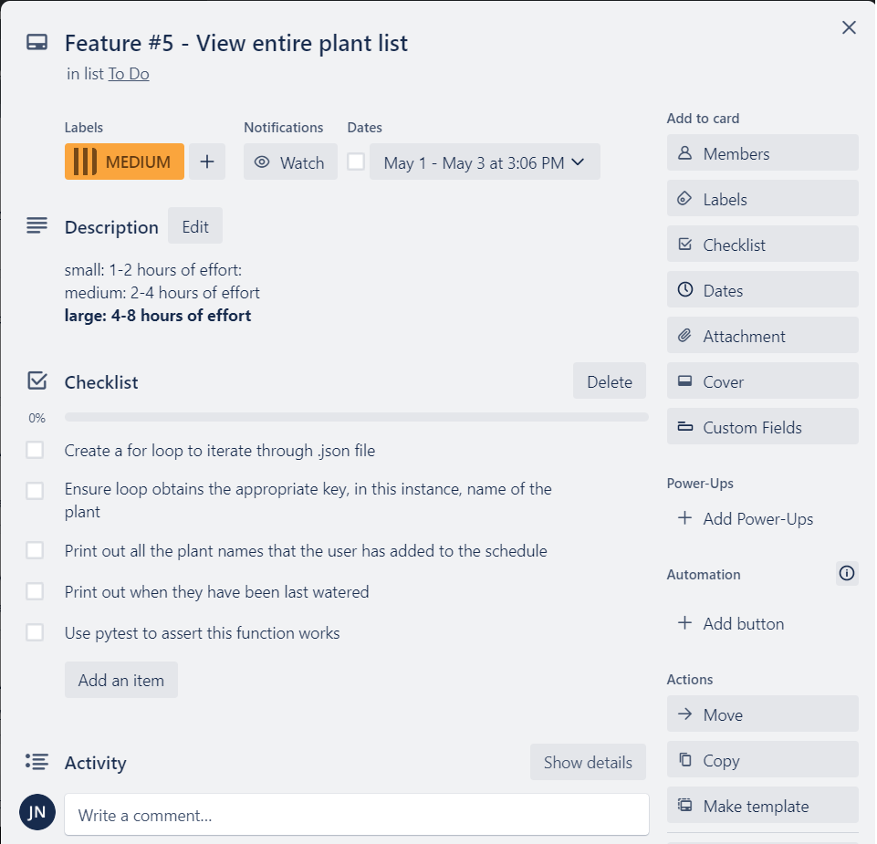
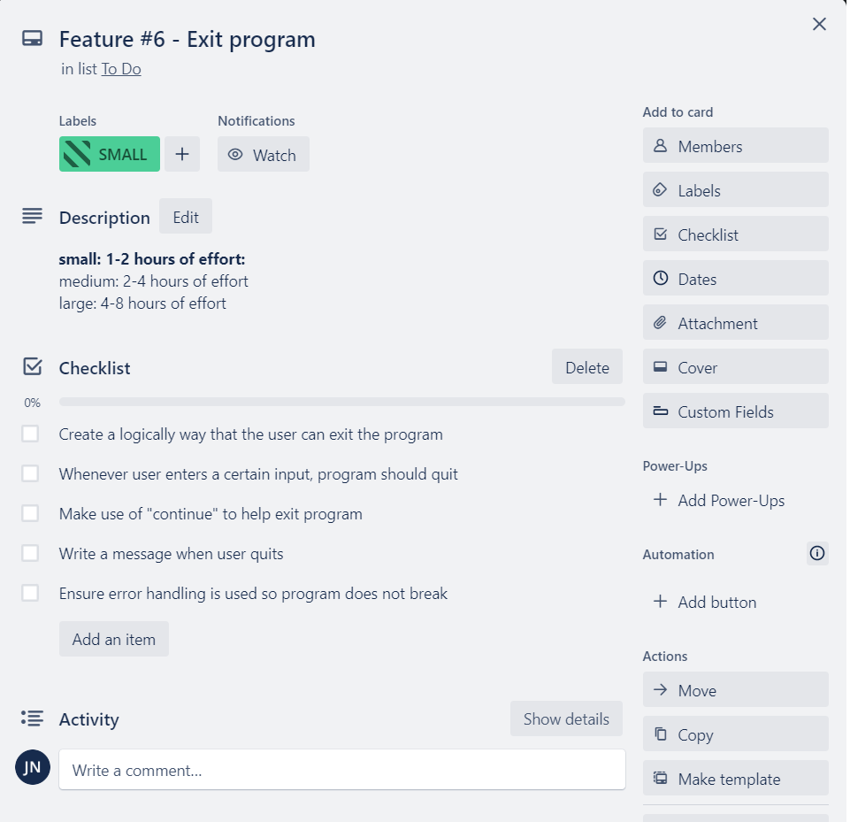

# Project Documentation

Written by Jeevan Ng

# Source Control Repository 

https://github.com/jeevanng/Plant-Watering-Schedule

# Code Style Guide 

The code styling guide followed is PEP 8. 

Find documentation on the style guide below: 

https://peps.python.org/pep-0008/

I have used pycodestyle to check code for conformance and autoformatted using the program autopep8 and yapf. All installed via pip in the virtual environment. 

These were the main elements that were not compliant with the pep 8 style guide;

```python
schedule_functions.py:3:47: W291 trailing whitespace
schedule_functions.py:5:1: E302 expected 2 blank lines, found 1
schedule_functions.py:8:1: W293 blank line contains whitespace
schedule_functions.py:12:44: W291 trailing whitespace
schedule_functions.py:13:13: W291 trailing whitespace
schedule_functions.py:32:80: E501 line too long (95 > 79 characters)
schedule_functions.py:32:96: W291 trailing whitespace
schedule_functions.py:33:17: W291 trailing whitespace
schedule_functions.py:36:80: E501 line too long (81 > 79 characters)
schedule_functions.py:37:80: E501 line too long (157 > 79 characters)
schedule_functions.py:46:80: E501 line too long (119 > 79 characters)
schedule_functions.py:47:80: E501 line too long (85 > 79 characters)
schedule_functions.py:53:80: E501 line too long (130 > 79 characters)
schedule_functions.py:59:80: E501 line too long (82 > 79 characters)
schedule_functions.py:60:80: E501 line too long (83 > 79 characters)
schedule_functions.py:67:80: E501 line too long (148 > 79 characters)
schedule_functions.py:71:1: W293 blank line contains whitespace
schedule_functions.py:82:39: W291 trailing whitespace
schedule_functions.py:83:33: E127 continuation line over-indented for visual indent
schedule_functions.py:83:42: W291 trailing whitespace
schedule_functions.py:84:33: E127 continuation line over-indented for visual indent
schedule_functions.py:84:48: E231 missing whitespace after ','
schedule_functions.py:89:80: E501 line too long (116 > 79 characters)
schedule_functions.py:99:45: W291 trailing whitespace
schedule_functions.py:100:37: E127 continuation line over-indented for visual indent
schedule_functions.py:100:46: W291 trailing whitespace
schedule_functions.py:101:37: E127 continuation line over-indented for visual indent
schedule_functions.py:101:52: E231 missing whitespace after ','
schedule_functions.py:102:1: W293 blank line contains whitespace
schedule_functions.py:110:1: W293 blank line contains whitespace
schedule_functions.py:112:80: E501 line too long (89 > 79 characters)
schedule_functions.py:115:80: E501 line too long (221 > 79 characters)
schedule_functions.py:116:80: E501 line too long (114 > 79 characters)
schedule_functions.py:117:1: W293 blank line contains whitespace
schedule_functions.py:121:80: E501 line too long (88 > 79 characters)
schedule_functions.py:124:1: W293 blank line contains whitespace
schedule_functions.py:127:1: W293 blank line contains whitespace
schedule_functions.py:128:31: W291 trailing whitespace
schedule_functions.py:130:54: W291 trailing whitespace
schedule_functions.py:132:1: W293 blank line contains whitespace
schedule_functions.py:134:39: W291 trailing whitespace
schedule_functions.py:135:29: E127 continuation line over-indented for visual indent
schedule_functions.py:136:29: E127 continuation line over-indented for visual indent
schedule_functions.py:136:44: E231 missing whitespace after ','
schedule_functions.py:137:1: W293 blank line contains whitespace
schedule_functions.py:143:80: E501 line too long (125 > 79 characters)
schedule_functions.py:149:80: E501 line too long (86 > 79 characters)
schedule_functions.py:150:80: E501 line too long (87 > 79 characters)
schedule_functions.py:157:80: E501 line too long (152 > 79 characters)
schedule_functions.py:158:1: W293 blank line contains whitespace
schedule_functions.py:159:31: W291 trailing whitespace
schedule_functions.py:165:43: W291 trailing whitespace
schedule_functions.py:166:33: E127 continuation line over-indented for visual indent
schedule_functions.py:167:33: E127 continuation line over-indented for visual indent
schedule_functions.py:167:48: E231 missing whitespace after ','
schedule_functions.py:168:1: W293 blank line contains whitespace
schedule_functions.py:169:80: E501 line too long (83 > 79 characters)
schedule_functions.py:173:1: W293 blank line contains whitespace
schedule_functions.py:175:32: W291 trailing whitespace
schedule_functions.py:179:80: E501 line too long (112 > 79 characters)
schedule_functions.py:179:111: E202 whitespace before ')'
schedule_functions.py:180:1: W293 blank line contains whitespace
schedule_functions.py:181:1: W293 blank line contains whitespace
schedule_functions.py:181:5: W292 no newline at end of file
```

# List of Features

This terminal application will allow a user to create their own plant watering schedule for three different frequencies; weekly, fortnightly and monthly. 

It will use file handling to create a json file which will hold information that the user enters. Python will read and write this file as information is updated.

## Feature #1 - Add plant to schedule 

This feature will allow the user to add information to the schedule, such as plant name, frequency of watering (weekly, fortnightly or monthly), when the plant was last watered (in days) etc. 

Error handling will be used to ensure that the user will not be able to enter anything other than what is desired by the application. E.g. Data type of integer for "When the plant was last watered (days)"

## Feature #2 - Remove plant from schedule 

The user will be able to remove a plant from the schedule. 

## Feature #3 - View plants that need watering
View which plants need watering today. 

This feature will display the current day using the built-in datetime library in Python and list which plants need to be watered.

## Feature #4 - Mark plant as watered

Mark plant as watered. This feature will enable the user to let the program know which plant has been watered so that it does not show up as needing watering until required. 

## Feature #5 - View entire plant list 
This feature will allow the user to view the entire list of plants they have added to the schedule and show when they were all last watered. 

## Feature #6 - Exit program
This feature will allow the user to exit the program. 

# Implementation Plan

## Create .json file 

At the beginning of our program, we can check if a .json file exists, and if it does then we can proceed as normal. If not, then we can create one for the user. 

We can use a try, except block to check those conditions stated above. 

## Feature #1 - Add plant to schedule 

This feature will take input from the user to compile into the .json file, such as;

- Name of plant 
- Frequency of watering (weekly, fortnightly or monthly) 
- When the plant was last watered (days)
- Amount of water needed

## Feature #2 - Remove plant from schedule 

This feature will get an input from the user and ask them to type which plant they wish to remove. This would be used if the plant died, was given away or they propagated it into various pots. 

e.g
```python
remove_plant = input("Please type which plant you wish to remove from the schedule: ")
``` 

## Feature #3 - View plants that need watering

The terminal application will determine which plants to display with the following method;

The program will use the current date/time and subtract the value of the variable "When the plant was last watered (days)", which will be converted from days into a date time object. This should let us know how many days it has been since the plant was last watered. 

We can then give our program some logic and display the plants if they meet certain conditions, such as;

```python
if frequency == "weekly" and last_watered >= 7
    print(f"{plant}")

if frequency == "fortnightly" and last_watered >= 14
    print(f"{plant}")

if frequency == "monthly" and last_watered >= 30
    print (f"{plant}")
```
## Feature #4 - Mark plant as watered

This feature will reset the variable "When was the plant last watered (days)", and assign it a new date which will be equal to the date they marked as watered. 

This means that if the user misses a watering one of their plants for a couple of days, whenever they mark as watered, it will then take the weekly, fortnightly or monthly schedule from that date. This is much better logic than assigning plants to be watered on a certain day, and printing out the list according to that day. 

For example, if a user assigns a plant to the schedule that needs to be watered every week. If they forgot to water their plant for 3 days, and then mark as complete. If we assigned it a weekday, it would show as needing to be watered 4 days later. However, if we assign the date/time, whenever they mark it as complete, it will then show up as being watered 7 days later. One week.

## Feature #5 - View entire plant list 

For this feature, it can be implemented by looping through the entire .json file and printing out the "key" that we assign to the plant names, and print them all out. We can also print out when they were last watered. 

```python
print(f"{file_name[0]["name"]}, which was last watered  {file_name[1]["last_watered"]} days ago.")
```

## Feature #6 - Exit program

When the user enters a certain input, we can break out of the loop (program) and exit with a friendly message. 

```python
print("Thank you for using the plant watering schedule. See you next time")
```

## Project Management Platform

I have used Trello to track tasks, add deadlines, prioritise different features and add checklists for each feature.

Each card has a color to show how much resources in time it will roughly take. They also include colorblind feature mode. The colors are;

- Green (SMALL) 
    - 1-2 hours of effort:
- Orange (MEDIUM)
    - medium: 2-4 hours of effort
= Red (LARGE) 
    - large: 4-8 hours of effort

### Overview



### Create .json File 



### Feature #1 - Add plant to schedule 



### Feature #2 - Remove plant from schedule 



### Feature #3 - View plants that need watering



### Feature #4 - Mark plant as watered



### Feature #5 - View entire plant list 



### Feature #6 - Exit program



# Libraries/Packages Used

1. pytest
2. json
3. colored
4. style
5. datetime
6. unittest.mock
7. pycodestyle
8. autopep8
9. yapf
10. emoji

# Testing

## Testing Method #1 (MANUAL)

Please click link below to see excel spreadsheet: 

[Testing spreadsheet (PDF)](./docs/testing.pdf)

Otherwise, the table has been converted for mark up language;

| TEST PLAN (MANUAL TESTING)                   |     |                                             |      |                                                                                             |        |                                                                                   |               |                          |  |  |  |  |  |
|----------------------------------------------|-----|---------------------------------------------|------|---------------------------------------------------------------------------------------------|--------|-----------------------------------------------------------------------------------|---------------|--------------------------|--|--|--|--|--|
|                                              |     |                                             |      |                                                                                             |        |                                                                                   |               | Test Date: 4th May, 2022 |  |  |  |  |  |
|                                              |     |                                             |      |                                                                                             |        |                                                                                   |               |                          |  |  |  |  |  |
|                                              |     |                                             |      |                                                                                             |        |                                                                                   |               |                          |  |  |  |  |  |
| PLANT WATERING SCHEDULE TERMINAL APPLICATION |     |                                             |      |                                                                                             |        |                                                                                   |               |                          |  |  |  |  |  |
|                                              |     |                                             |      |                                                                                             |        |                                                                                   |               |                          |  |  |  |  |  |
| PROCESS                                      | NO. | TEST CASE                                   | STEP | DESCRIPTION                                                                                 | STATUS | EXPECTED RESULT                                                                   | ACTUAL RESULT | COMMENT                  |  |  |  |  |  |
|                                              |     |                                             |      |                                                                                             |        |                                                                                   |               |                          |  |  |  |  |  |
| Check/create data.json file                  | 1   | File handling                               |      |                                                                                             |        |                                                                                   |               |                          |  |  |  |  |  |
|                                              |     |                                             | 1    | Check to see if .json file exists                                                           | passed | Uses try to check if file exists                                                  |               |                          |  |  |  |  |  |
|                                              |     |                                             | 2    | If it exists, just read file                                                                | passed | Reads file and data correctly                                                     |               |                          |  |  |  |  |  |
|                                              |     |                                             | 3    | If it does not exist, create new .json file                                                 | passed | Creates file if not found                                                         |               |                          |  |  |  |  |  |
|                                              |     |                                             | 4    | Write empty list into file                                                                  | passed | Creates empty list []                                                             |               |                          |  |  |  |  |  |
|                                              |     |                                             | 5    | data = []                                                                                   | passed |                                                                                   |               |                          |  |  |  |  |  |
|                                              |     |                                             | 6    | File should be named data.json                                                              | passed | file name is data.json                                                            |               |                          |  |  |  |  |  |
|                                              |     |                                             |      |                                                                                             |        |                                                                                   |               |                          |  |  |  |  |  |
|                                              |     |                                             |      | Enter some sample data to test input is added correctly to data.json                        |        |                                                                                   |               |                          |  |  |  |  |  |
|                                              |     |                                             |      | "Name" = "Monstera"                                                                         | passed | Added to data.json                                                                |               |                          |  |  |  |  |  |
|                                              |     |                                             |      | "Frequency" = "fortnightly"                                                                 | passed | Added to data.json                                                                |               |                          |  |  |  |  |  |
|                                              |     |                                             |      | "Last_Watered" = "2023-05-02"                                                               | passed | Added to data.json                                                                |               |                          |  |  |  |  |  |
|                                              |     |                                             |      | "Water_Needed" = "100"                                                                      | passed | Added to data.json                                                                |               |                          |  |  |  |  |  |
| Add plant                                    | 2   | Function to Add                             |      |                                                                                             |        |                                                                                   |               |                          |  |  |  |  |  |
|                                              |     |                                             | 1    | Ask for user input (Name of plant)                                                          | passed | Allows user to enter a string                                                     |               |                          |  |  |  |  |  |
|                                              |     |                                             | 2    | Ask for user input (Frequency)                                                              | passed | Accepts "weekly", "fortnightly" and "monthly" only                                |               |                          |  |  |  |  |  |
|                                              |     |                                             | 3    | If user does not enter weekly, fortnightly or monthly, raise Value Error                    | passed | Raise exception                                                                   |               |                          |  |  |  |  |  |
|                                              |     |                                             | 4    | Keep raising Value Error until user enters valid input                                      | passed | Keeps looping through exception                                                   |               |                          |  |  |  |  |  |
|                                              |     |                                             | 5    | Allow user to quit loop ("q" or "quit") and go back to main menu                            | passed | Exits the entire function                                                         |               |                          |  |  |  |  |  |
|                                              |     |                                             | 6    | Ask for user input (When the plant was last watered in YYYY-MM-DD)                          | passed | Allows user to enter date                                                         |               |                          |  |  |  |  |  |
|                                              |     |                                             | 7    | Raise Value Error if not in the correct date format                                         | passed | Raise exception                                                                   |               |                          |  |  |  |  |  |
|                                              |     |                                             | 8    | Allow user to quit loop ("q" or "quit") and go back to main menu                            | passed | Exits function                                                                    |               |                          |  |  |  |  |  |
|                                              |     |                                             | 9    | Ask for user input (How much water is needed in mL)                                         | passed | Allows user to enter data in mL                                                   |               |                          |  |  |  |  |  |
|                                              |     |                                             | 10   | If input can not be converted to integer, raise Value Error                                 | passed | If input can be converted to integer, proceed                                     |               |                          |  |  |  |  |  |
|                                              |     |                                             | 11   | If input is not greater than or equal to 0, raise Value Error                               | passed | Raise exception if number is less than 0                                          |               |                          |  |  |  |  |  |
|                                              |     |                                             | 12   | Once all inputs entered correctly, read data.json and create dictionary with inputs         | passed | Open and read data.json, create new dictionary                                    |               |                          |  |  |  |  |  |
|                                              |     |                                             | 13   | Append to empty list and write to data.json                                                 | passed | Append to empty list and write to data.json                                       |               |                          |  |  |  |  |  |
|                                              |     |                                             | 14   | Adding a new plant should not overwrite any existing data in data.json                      | passed | Adds new plant to list and keeps exisitng data intact                             |               |                          |  |  |  |  |  |
|                                              |     |                                             | 15   | Format should be consistent                                                                 | passed | Same format across all plants                                                     |               |                          |  |  |  |  |  |
|                                              |     |                                             | 16   | If user quits midway through adding plant, no infromation gets added to data.json           | passed | No input is stored and no data is added to file                                   |               |                          |  |  |  |  |  |
| Remove plant                                 | 3   | Function to Remove                          |      |                                                                                             |        |                                                                                   |               |                          |  |  |  |  |  |
|                                              |     |                                             | 1    | Ask for user input (Name of plant)                                                          | passed | Allows user to enter input (Name of plant)                                        |               |                          |  |  |  |  |  |
|                                              |     |                                             | 2    | Opens and reads data.json                                                                   | passed | Open data.json and read contents                                                  |               |                          |  |  |  |  |  |
|                                              |     |                                             | 3    | If the string (from user input) is not equal to the key value under "Name"                  | passed | Conditional statement                                                             |               |                          |  |  |  |  |  |
|                                              |     |                                             | 4    | Append to empty list variable (plant_list)                                                  | passed | Adds all the plants that do not have the same string as user input                |               |                          |  |  |  |  |  |
|                                              |     |                                             | 5    | Write data to data.json                                                                     | passed | Writes the correct data to data.json                                              |               |                          |  |  |  |  |  |
|                                              |     |                                             | 6    | data.json should contain all existing plants minus the one the user entered                 | passed | Whatever the user entered is now omitted from data.json                           |               |                          |  |  |  |  |  |
|                                              |     |                                             | 7    | If user enters a plant not in data.json, does nothing                                       | passed | Does not omit anything if user enters a string not found in file                  |               |                          |  |  |  |  |  |
|                                              |     |                                             | 8    | Test to see if function removes desired input from data.json and writes the rest            | passed | Does function work as intended                                                    |               |                          |  |  |  |  |  |
| View plants that need watering today         | 4   | Function to View which Plants need Watering |      |                                                                                             |        |                                                                                   |               |                          |  |  |  |  |  |
|                                              |     |                                             | 1    | The variable now, is a time date object and is equal to today's date                        | passed | Variable is equal to today's date                                                 |               |                          |  |  |  |  |  |
|                                              |     |                                             | 2    | Open and read data.json                                                                     | passed | Opens file                                                                        |               |                          |  |  |  |  |  |
|                                              |     |                                             | 3    | Loop through every iteration (dictionary) of data.json                                      | passed | Loops through every iteration in list                                             |               |                          |  |  |  |  |  |
|                                              |     |                                             | 4    | Calculate the difference in days between variable now and "Last_Watered" date               | passed | Calculates the difference in .days                                                |               |                          |  |  |  |  |  |
|                                              |     |                                             | 5    | if "Frequency" is equal to "weekly" and difference in days is >= 7, display                 | passed | Display correctly with sample data                                                |               |                          |  |  |  |  |  |
|                                              |     |                                             | 6    | if "Frequency" is equal to "fortnightly" and difference in days is >= 14, display           | passed | Display correctly with sample data                                                |               |                          |  |  |  |  |  |
|                                              |     |                                             | 7    | if "Frequency" is equal to "monthly" and difference in days is >= 30, display               | passed | Display correctly with sample data                                                |               |                          |  |  |  |  |  |
|                                              |     |                                             |      |                                                                                             |        |                                                                                   |               |                          |  |  |  |  |  |
|                                              |     |                                             |      | Enter some sample data to test if program is displaying plants correctly                    |        |                                                                                   |               |                          |  |  |  |  |  |
|                                              |     |                                             | 8    | Plant1, "weekly", last watered 10 days ago                                                  | passed | Printed in display                                                                |               |                          |  |  |  |  |  |
|                                              |     |                                             | 9    | Plant2, "weekly", last watered 2 days ago                                                   | passed | NOT printed in display                                                            |               |                          |  |  |  |  |  |
|                                              |     |                                             | 10   | Plant3, "fortnightly", last watered 40 days ago                                             | passed | Printed in display                                                                |               |                          |  |  |  |  |  |
|                                              |     |                                             | 11   | Plant4, "fortnightly", last watered 6 days ago                                              | passed | NOT printed in display                                                            |               |                          |  |  |  |  |  |
|                                              |     |                                             | 12   | Plant5, "monthly", last watered 34 days ago                                                 | passed | Printed in display                                                                |               |                          |  |  |  |  |  |
|                                              |     |                                             | 13   | Plant6, "monthly", last watered 10 days ago                                                 | passed | NOT printed in display                                                            |               |                          |  |  |  |  |  |
| Mark plant as watered                        | 5   | Function to Mark Plant as Watered           |      |                                                                                             |        |                                                                                   |               |                          |  |  |  |  |  |
|                                              |     |                                             | 1    | Ask for user input (Name of plant)                                                          | passed | Allow user to enter input (Name of Plant)                                         |               |                          |  |  |  |  |  |
|                                              |     |                                             | 2    | Get today's date as a variable                                                              | passed | Fetch today's date as a variable                                                  |               |                          |  |  |  |  |  |
|                                              |     |                                             | 3    | Convert today's date into a string                                                          | passed | Convert today's date into a string datatype                                       |               |                          |  |  |  |  |  |
|                                              |     |                                             | 4    | Open and read data.json                                                                     | passed | Open file                                                                         |               |                          |  |  |  |  |  |
|                                              |     |                                             | 5    | If user input (name) is equal to key value of "Name" in data.json                           | passed | Loop through data.json file                                                       |               |                          |  |  |  |  |  |
|                                              |     |                                             | 6    | Change "Last_Watered" to today's date                                                       | passed | If name matches "Name", change "Last_Watered" to today's date as a string         |               |                          |  |  |  |  |  |
|                                              |     |                                             | 7    | Write changes to data.json                                                                  | passed | Write changes into data.json                                                      |               |                          |  |  |  |  |  |
|                                              |     |                                             |      |                                                                                             |        |                                                                                   |               |                          |  |  |  |  |  |
|                                              |     |                                             |      | Test to see whether function changes date in data.json                                      |        |                                                                                   |               |                          |  |  |  |  |  |
|                                              |     |                                             | 8    | Does "Last_Watered" change to today's date in data.json                                     | passed | Manually check whether this function works                                        |               |                          |  |  |  |  |  |
| Update amount of water needed                | 6   | Function to Change Amount of Water Needed   |      |                                                                                             |        |                                                                                   |               |                          |  |  |  |  |  |
|                                              |     |                                             | 1    | Ask for user input (Name of plant)                                                          | passed | Allow user to enter input (Name of Plant)                                         |               |                          |  |  |  |  |  |
|                                              |     |                                             | 2    | Open and read data.json                                                                     | passed | Open file                                                                         |               |                          |  |  |  |  |  |
|                                              |     |                                             | 3    | Allow user to exit back to main menu by typing "q" or "quit"                                | passed | Typing "q" or "quit" will exit program and not store/change any data in data.json |               |                          |  |  |  |  |  |
|                                              |     |                                             | 4    | Ask for user input (change amount of water needed for a plant in mL)                        | passed | Allow user to enter input (Amount of water needed mL)                             |               |                          |  |  |  |  |  |
|                                              |     |                                             | 5    | Use try, to change data type into an integer                                                | passed | Can the input be converted into an integer data type?                             |               |                          |  |  |  |  |  |
|                                              |     |                                             | 6    | Is the integer greater than or equal to 0? Then proceed                                     | passed | Is the integer >= 0 ?                                                             |               |                          |  |  |  |  |  |
|                                              |     |                                             | 7    | Otherwise, raise Value Error                                                                | passed | Does the function raise a Value Error if the two above conditions are not True?   |               |                          |  |  |  |  |  |
|                                              |     |                                             | 8    | Loop through data, if all conditions are true. Change value of "Water_Needed" to new input  | passed | Does function change the value we want, if the plant names are equal?             |               |                          |  |  |  |  |  |
|                                              |     |                                             | 9    | Write data to data.json                                                                     | passed | Writes new data to data.json                                                      |               |                          |  |  |  |  |  |
|                                              |     |                                             |      |                                                                                             |        |                                                                                   |               |                          |  |  |  |  |  |
|                                              |     |                                             |      | Test to see whether function changes date in data.json                                      |        |                                                                                   |               |                          |  |  |  |  |  |
|                                              |     |                                             | 10   | Does "Water_Needed" change to user input entered in data.json                               | passed | Manually check                                                                    |               |                          |  |  |  |  |  |
| View entire plant list                       | 7   | Function to View Entire Plant List          |      |                                                                                             |        |                                                                                   |               |                          |  |  |  |  |  |
|                                              |     |                                             | 1    | Open and read data.json                                                                     | passed | Open file                                                                         |               |                          |  |  |  |  |  |
|                                              |     |                                             | 2    | Print off plant names (i.e. "Name" key)                                                     | passed | Loop through data.json to print plant names                                       |               |                          |  |  |  |  |  |
|                                              |     |                                             | 3    | Print off other data that the programmer wishes the user to see                             | passed | Displays other information as desired                                             |               |                          |  |  |  |  |  |
|                                              |     |       

## Testing Method #2 (PYTEST)

I have used pytest to test two main functions of the program. Whether the function adds the plants and other corresponding information correctly, and whether it removes the plant/information and shows the correct length for the total data once a plant has been removed. 

Here is the code;

```python
import pytest
import json

from schedule_functions import PlantSchedule
from unittest.mock import patch


file_name = "test_data.json"

def test_add_plant():
    with patch('builtins.input', side_effect=["Monstera", "monthly", "2023-04-10", "300"]):
        test_add = PlantSchedule(file_name)
        test_add.add_plant()

    with open(file_name) as f:
        data = json.load(f)

    assert len(data) == 1
    assert data[0]["Name"] == "Monstera"
    assert data[0]["Frequency"] == "monthly"
    assert data[0]["Last_Watered"] == "2023-04-10"
    assert data[0]["Water_Needed"] == "300"

def test_remove_plant():
    with patch('builtins.input', side_effect=["Monstera", "monthly", "2023-04-10", "300"]):
        test_add = PlantSchedule(file_name)
        test_add.remove_plant()
    
    with open(file_name) as f:
        data = json.load(f)

    assert len(data) == 2
```

I have created a test_data.json file, to store the information without altering the originals. I change the assertions according to what data is in the .json file, and which variables I am testing. I will comment out the remove testing part and vice versa, to test each function separately. 

# Design Help Documentation 

